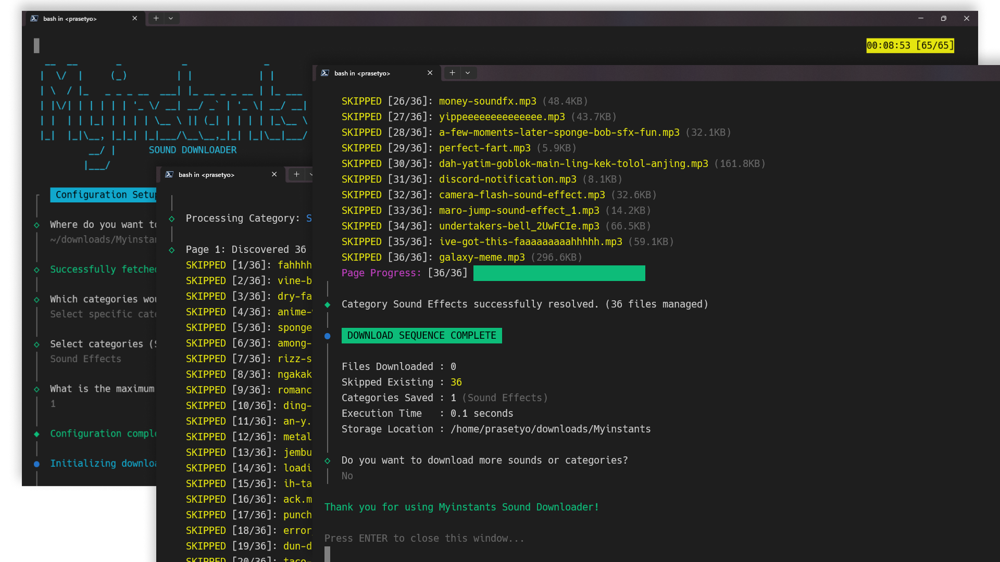

<div align="center">
    <h1 style="font-size: xx-large;">Myinstants Sound Downloader</h1>
</div>


A lightning-fast, interactive Command Line Interface (CLI) application to batch download audio memes and sound effects from [Myinstants.com](https://www.myinstants.com). Built with Bun and TypeScript, this tool offers a beautiful terminal UI, real-time streaming progress, and cross-platform compatibility.



## Key Features

- **Interactive UI**: Beautiful and intuitive terminal prompts powered by `@clack/prompts`.
- **Real-Time Streaming**: Watch downloads happen at the byte level with real-time progress bars.
- **Idempotency (Smart Skip)**: Automatically detects existing files and skips them to save bandwidth and time.
- **Humanized Throttling**: Built-in randomized delays between downloads to prevent IP bans and respect server rate limits.
- **Cross-Platform Pathing**: Safely handles OS-specific paths, including resolving Unix home directories (`~/`) perfectly on both WSL and Windows.
- **Standalone Executables**: Can be compiled into single binary files. End-users don't need to install Bun to use the app!

---

## ⚠️ Important Notice Regarding File Size

> You might notice that the compiled executable files are quite large (ranging from ~30MB to 110MB+ depending on the OS and compression). **This is expected behavior and not a bug.**

> Unlike applications written in natively compiled languages (like Go, Rust, or C++), this tool is built using TypeScript and the Bun runtime. To ensure this application runs completely standalone—meaning end-users **do not** need to install Node.js, Bun, or any other dependencies on their computers—the _entire Bun JavaScript engine and runtime_ is packaged directly inside the executable.

> This is a conscious engineering trade-off: **zero setup and maximum user convenience at the cost of a larger file size.**

---

## How to Use (For Regular Users)

You don't need to be a programmer or install any coding tools to use this app. Just download the executable file for your operating system from the **[Releases](../../releases)** page.

### Windows (`-windows-x64.exe`)

1. Download the `.exe` file.
2. **Double-click** the file to run it.
3. _Note: If Windows Defender SmartScreen blocks the app, click **"More info"** and then **"Run anyway"**._

### macOS (`-mac-x64` or `-mac-arm64`)

_Use `arm64` if you have an Apple Silicon chip (M1/M2/M3). Use `x64` for older Intel Macs._

1. Download the file.
2. Locate the file in Finder.
3. Because Apple restricts apps outside the App Store, you must **Right-Click** (or Control+Click) the file and select **Open**.
4. Click **Open** again on the security prompt. The Terminal will launch automatically.

### Linux (`-linux-x64` or `-linux-arm64`)

1. Download the file.
2. Open your terminal in the download folder and grant execution permissions:
    ```bash
    chmod +x sound-downloader-linux-x64
    ```
3. Run the application:
    ```bash
    ./sound-downloader-linux-x64
    ```

---

## Development Guide (For Engineers)

If you want to view the source code, modify the application, or build the binaries yourself, follow these steps:

### Prerequisites

- Bun installed on your system (v1.3 or higher).

### 1. Installation

Clone the repository and install the dependencies:

```bash
git clone https://github.com/aziz-prasetyo/myinstants-sound-downloader.git

cd myinstants-sound-downloader

bun install
```

### 2. Running the Application

To run the CLI in development mode:

```bash
bun start
```

### 3. Code Quality & Formatting

This project strictly enforces code quality using ESLint and Prettier.

- **Format code:** `bun format`
- **Lint code:** `bun lint`
- **Auto-fix linting errors:** `bun lint:fix`

### 4. Building the Releases (Cross-Compilation)

To generate standalone executables for Windows, macOS, and Linux all at once, run:

```bash
bun build:release
```

The compiled binary files will be generated inside the `dist/` folder. _(Note: The `dist/` folder is ignored by Git to keep the repository clean)._

---

## Tech Stack

- **Runtime:** [Bun](https://bun.sh/)
- **Language:** [TypeScript](https://www.typescriptlang.org/)
- **Validation:** [Valibot](https://valibot.dev/)
- **CLI Framework:** [@clack/prompts](https://clack.cc/)
- **Styling:** [Picocolors](https://github.com/alexeyraspopov/picocolors)

## License

This project is open-source and available under the MIT License.

---

© 2026 **Muhammad Aziz Prasetyo**
